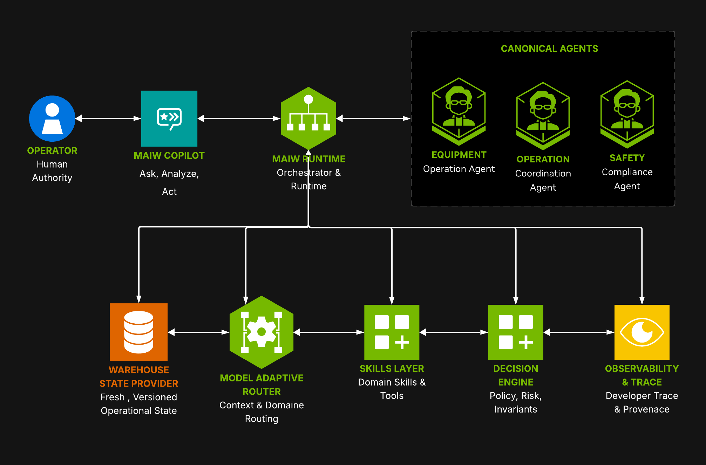

# Multi-Agent Intelligent Warehouse (MAIW)

*An NVIDIA AI Blueprint for agentic warehouse operations powered by Nemotron 3 and MCP v2.*

[](https://opensource.org/licenses/Apache-2.0)
[](https://www.python.org/downloads/)
[](https://fastapi.tiangolo.com/)
[](https://reactjs.org/)
[](https://www.nvidia.com/en-us/ai-data-science/nim/)

---

## What MAIW Is

**MAIW — Multi-Agent Intelligent Warehouse — is an operational AI architecture for reasoning about, governing, and acting on dynamic warehouse systems.**

MAIW is designed around a simple question:

> **What does it take for AI to participate safely in running a warehouse — not simply answer questions about one?**

Warehouse operations are continuously changing. Workers move between tasks, equipment fails, inventory changes, orders arrive, waves approach carrier cutoffs, and the state observed when reasoning begins may no longer be valid when an action is ready to execute.

MAIW addresses this by separating intelligence from operational authority.

The core lifecycle is:

**Observe → Reason → Propose → Decide → Approve → Execute → Observe Outcome**

### Observe

MAIW assembles a canonical `WarehouseState` across inventory, labor, equipment, and wave operations.

In Demo Mode, this state originates from a reproducible Warehouse World:

```
WarehouseWorldConfig → Canonical Operational Graph → WarehouseDataPack
        → ScenarioOverlay → Runtime World → WarehouseState
```

The Operational Graph models entities, relationships, events, and time — for example:

```
Worker → Task → Wave → Order → CarrierCutoff
```

This gives agents a coherent operational context rather than a collection of disconnected synthetic records.

### Reason

Agents request intelligence through a centralized **ModelGateway**, which selects the appropriate NVIDIA Nemotron model according to reasoning requirements, risk, and routing policy. Agents express what level of reasoning a decision requires; ModelGateway chooses the physical model.

Agents interact with warehouse domains through typed skills and vendor-neutral MCP capabilities.

### Propose

AI recommendations do not directly mutate warehouse systems.

They are converted into typed `ActionProposal` objects that explicitly describe the requested operational action, target, risk, and trace identity. A recommendation is intelligence; an `ActionProposal` is a governed operational artifact.

### Decide

Every proposal passes through a deterministic **DecisionEngine** that evaluates operational policy, state validity, risk, and invariants.

The language model is not the authority that decides whether a consequential warehouse action may execute.

### Approve

Where human authority is required, approval is explicit, expirable, bound to the proposal and decision, and single-use.

### Execute

Only a guarded **ActionExecutor** may cross the execution boundary and invoke a write-capable MCP capability against the configured operational provider.

The system maintains a non-negotiable invariant:

> **The LLM never touches a write path directly.**

AI recommends and proposes. The DecisionEngine governs. Human authority approves where required. The ActionExecutor executes.

MCP capabilities connect MAIW to operational providers such as simulation backends, WMS/WES systems, enterprise services, or other warehouse control interfaces.

### Observe Outcome

Execution success is not necessarily operational success.

MAIW observes the warehouse after execution and measures whether the intended operational outcome actually occurred: Did backlog fall? Did wave risk improve? Did throughput recover? Did the warehouse move toward the intended objective?

This closes the operational loop.

### Reliability and Provenance

MAIW treats distributed-systems uncertainty as a first-class concern.

If a write may have succeeded but its acknowledgement is lost, MAIW does not blindly retry:

```
UNKNOWN → suppress automatic retry → reread authoritative state → reconcile
```

Reconciliation may result in `CONFIRMED_EXECUTED` / `CONFIRMED_NOT_EXECUTED` / `INDETERMINATE`.

The architecture also includes execution identity, idempotency protection, request deadlines, circuit breakers, graceful degradation, approval-state management, and deterministic fault-injection evaluation.

Every operational interaction is traceable through:

```
Evidence → Agent Interpretation → Skills → Recommendation → ActionProposal
        → Decision → Approval → Execution → Outcome
```

MAIW exposes structured reasoning artifacts and provenance — not hidden model chain-of-thought — through the Agentic Reasoning Canvas, Decision Graph, **Why This Decision?**, and Developer Trace.

The Operational Graph and Decision Graph serve distinct purposes:

- **Operational Graph** — warehouse reality and operational context.
- **Decision Graph** — MAIW reasoning, governance, execution, and provenance.

### Copilot

MAIW Copilot is the conversational interaction layer over the same governed lifecycle. Operators ask natural-language questions, receive evidence-grounded analysis with ranked recommendations, and initiate governed warehouse actions — all through a single endpoint (`POST /api/v1/copilot/turn`).

**Three intents, one endpoint:**

| Intent | What it does |
|--------|-------------|
| **ASK** | Graph-grounded answer about current warehouse state. Returns evidence facts and Operational Graph neighborhood context. |
| **ANALYZE** | Deterministic severity assessment + ranked `RecommendedAction` list. Severity is computed before the LLM call; recommendations route through the standard governance pipeline when acted upon. |
| **ACT** | Converts the selected recommendation into a governed `ActionProposal`, evaluates it through `DecisionEngine`, and either executes (if approved autonomously) or queues for human approval via the existing `/demo/approve` endpoint. |

Copilot never bypasses `DecisionEngine`, human approval, or `ActionExecutor`. The trust boundary is enforced architecturally: `CopilotService` cannot import `ActionExecutor`, `ApprovalStore`, or `DecisionEngine` — only `GovernedActionOrchestrator` crosses that boundary, and only after a full policy evaluation.

---

The result is not simply a collection of warehouse agents.

**MAIW is a governed operational intelligence architecture that connects AI reasoning to safe, observable, traceable, and measurable warehouse action.**

---

## Architecture



### Pipeline Stages

| Stage | Component | What it does |
|-------|-----------|--------------|
| **STATE** | `WarehouseStateProvider` | Assembles live snapshot of inventory, equipment, labor, and wave data via MCP read tools |
| **REASON** | `ModelGateway` → Nemotron 3 | Generates a structured action proposal — no raw text, no direct tool calls |
| **PROPOSE** | `ActionProposal` factory | Constructs a typed, immutable proposal locally; zero MCP calls at this stage |
| **DECIDE** | `DecisionEngine` | Evaluates the proposal against deterministic constraints → `APPROVED / REJECTED / DEFERRED` |
| **EXECUTE** | `BaseActionExecutor` | Enforces 4 guards, assigns a stable `execution_id`, then invokes the MCP write capability; result is one of six explicit outcomes: `EXECUTED / NO_OP / DEFERRED / CONFLICT / UNKNOWN / FAILED` |
| **MCP** | `mcp_servers.<domain>.server` | Independently deployable MCP v2 server; single entry point to backend writes |
| **BACKEND** | PostgreSQL / TimescaleDB | Source of truth; no agent writes directly here |

---

## Warehouse World Model (Phase 14E)

Demo Mode data flows through a layered, deterministic world model. The canonical path is:

```
WarehouseWorldConfig
        ↓
WarehouseWorldGenerator  (deterministic, seed-based)
        ↓
Canonical Operational Graph
        ↓
WarehouseDataPack  (immutable, on-disk, verifiable)
        ↓
ScenarioOverlay  (disruption events)
        ↓
ScenarioWorld  (base + overlay, immutable view)
        ↓
DemoWarehouseWorld  (mutable runtime execution world)
        ↓
Simulation Providers  (unchanged)
        ↓
WarehouseStateProvider → WarehouseState → Agents
```

The graph is the canonical synthetic-world representation. Scenarios are overlays applied on top of an immutable base world. The mutable demo runtime is **derived from immutable sources, not the other way around**. Agents consume the same `WarehouseState` contracts they always have — they do not know `maiw-world` exists.

Demo Mode does **not** seed from YAML `initial_state` blocks or legacy SQL scripts. Those scripts (`scripts/data/quick_demo_data.py` etc.) are retained for reference but are not part of the v2 demo setup path.

### Three-State Distinction

**WarehouseDataPack** — `data/worlds/<dataset_id>/`

Immutable, reproducible warehouse artifact. Contains the canonical graph, entity IDs, seed, and semantic checksum. Never mutated by a demo run.

**ScenarioWorld**

Immutable view: DataPack base graph + deterministic scenario event overlay. Validates entity references at construction. Does not modify the DataPack.

**DemoWarehouseWorld**

Mutable runtime execution world. Derived from DataPack + ScenarioOverlay at scenario start. Providers read this; ActionExecutor may mutate it. Reset reconstructs it from immutable sources — not from a snapshot.

```
DataPack           = what the warehouse is
ScenarioWorld      = what happened to it
DemoWarehouseWorld = what MAIW is currently operating on
```

### Operational Graph vs. Decision Graph

These are separate models that share canonical IDs as linking artifacts.

```
Operational Graph  = warehouse reality and operational context
                     Worker → Task → Wave → Order → CarrierCutoff

Decision Graph     = MAIW reasoning and decision provenance
                     Evidence → Assessment → Recommendation → Proposal
                     → Decision → Approval → Execution → Outcome
```

They are never merged into a single structure.

### Reproducibility Identity

```
dataset_id + warehouse_id + seed  →  identifies the warehouse world (DataPack)
scenario                          →  identifies the disruption overlay
trace_id                          →  identifies one MAIW reasoning/execution interaction
```

These three identity dimensions are kept separate. `trace_id` is a runtime correlation identifier — it does not identify a warehouse world or scenario.

See [docs/developer/WAREHOUSE_WORLD_MODEL.md](docs/developer/WAREHOUSE_WORLD_MODEL.md) for the full specification.

---

## Warehouse World Explorer (Phase 17)

The **Warehouse World Explorer** is the operational observability UI for the running world. It is accessed from the WORLD tab in the demo shell and provides read-only inspection of the entire operational lifecycle — from the immutable DataPack through scenario overlays to the live runtime state.

### What the Explorer exposes

| Tab | Purpose |
|-----|---------|
| **OVERVIEW** | Warehouse identity (`dataset_id`, `seed`, `semantic_checksum`), entity/edge/event counts, scenario summary |
| **CHANGES** | Full scenario overlay events and affected-entity list (BASE → SCENARIO transitions) |
| **GRAPH** | Search-first entity browser backed by the Canonical Operational Graph; bounded neighborhood visualization |
| **LIVE** | Runtime state delta (field-level changes from governed execution: before/after KPIs, changed entities) |
| **RAW** | Paginated entity browser; hard server cap of 50 entities per page — never returns the full 51k entity set |
| **CONTEXT** | OperationalContextSnapshot list; exact bounded graph context captured BEFORE each model call, linked by `turn_id` and `trace_id` |

### WORLD API

All World Explorer data is served by a read-only API at `GET /api/v1/world/*`. The router imports no execution, decision, approval, or orchestration symbols. Key routes:

| Route | Purpose | Bound |
|-------|---------|-------|
| `GET /config` | Warehouse identity, config, DataPack checksum | — |
| `GET /summary` | Live entity counts, scenario state | — |
| `GET /changes` | Scenario overlay events (SCENARIO layer) | — |
| `GET /live` | LIVE runtime delta with KPI before/after | — |
| `GET /graph/search` | Entity search | — |
| `GET /graph/entity/{id}` | Single entity detail + direct edges | — |
| `GET /graph/neighbors/{id}` | Bounded BFS neighborhood | Truncated to 50 nodes |
| `GET /graph/entities` | Paginated entity browser | Hard cap: 50 per page |
| `GET /context/snapshots` | List all operational context snapshots | — |
| `GET /context/by-turn/{turn_id}` | Exact context snapshot for a Copilot turn | — |

### OperationalContextSnapshot

Each Copilot turn that reaches the model produces one `OperationalContextSnapshot`. It is captured **before the model call** — not reconstructed afterward. It is:

- Linked to the turn via `turn_id`, `trace_id`, and `context_snapshot_id`
- Linked to the DataPack via `datapack_checksum` (the same immutable `semantic_checksum`)
- Immutable after capture — LIVE mutations do not change historical snapshots
- Inspectable in the CONTEXT tab or via `GET /context/by-turn/{turn_id}`

See [docs/developer/WAREHOUSE_WORLD_EXPLORER.md](docs/developer/WAREHOUSE_WORLD_EXPLORER.md) for the full developer reference.

---

## Core Design Principles

1. **LLMs propose, policy decides.** The `DecisionEngine` is synchronous, deterministic, and
   performs no I/O. It cannot be overridden by a model-generated argument.

2. **Every write passes through a typed executor.** `BaseActionExecutor` checks four guards in
   order before any MCP write tool is called: (1) decision outcome is `APPROVED`, (2) decision
   binds to the exact proposal ID, (3) action name is in the executor's static allowlist,
   (4) the decision is not stale.

3. **State is immutable once sealed.** `WarehouseStateSnapshot.seal()` assigns a UUID and freezes
   the snapshot. Proposals reference the snapshot ID; the executor performs a best-effort state
   drift check before executing.

4. **Packages have one-way dependency flow.** `maiw-models` and `maiw-mcp` have no upstream
   dependencies. `maiw-state` and `maiw-skills` depend only on those. `maiw-decision` and
   `maiw-execution` depend on skills and state. `maiw-agents` depends on all of them. Nothing
   in any canonical package imports from `src.*`.

5. **MCP is the write plane, not a chat interface.** MCP tools are not exposed to the LLM's tool
   registry. The LLM produces a proposal; the executor translates that proposal to an MCP call.

---

## Nemotron Model Gateway

All inference is routed through a centralized `ModelGateway`. Agents specify what they need
(reasoning depth, risk level, task type) — never a physical model ID.

### Model Roles

| Role | Default model | Status | Use case |
|------|--------------|--------|----------|
| `lightning` | `nvidia/nemotron-3.5-lightning-30b-a3b` | Enabled | Fast chat, intent classification |
| `nano` | `nvidia/nemotron-3-nano-30b-a3b` | Enabled | Lightweight reasoning, fast-path fallback |
| `super` | `nvidia/nemotron-3-super-120b-a12b` | **Primary** | Standard operational reasoning |
| `ultra` | `nvidia/nemotron-3-ultra-550b-a55b` | Opt-in | Deep analytical tasks (~31s latency) |

Agents specify `ReasoningLevel` and `RiskLevel` — never a physical model ID. `ModelRouter`
resolves the role. When a role is disabled or unavailable, requests fall through the fallback
chain (e.g. `nano → super`). The `CopilotTurnResponse` exposes `requested_role`, `selected_role`,
`fallback_from`, and `fallback_reason` so every routing decision is observable.

### Deployment Modes

| Mode | When to use | Key env vars |
|------|-------------|-------------|
| `nvidia_hosted` (default) | NVIDIA public cloud | `NVIDIA_API_KEY` |
| `local_nim` | Self-hosted NIM on-prem | `MAIW_NIM_BASE_URL`, `MAIW_NIM_MODEL` |
| `openai_compatible` | vLLM, Ollama, any OAI endpoint | `MAIW_NIM_BASE_URL`, `MAIW_NIM_MODEL` |
| `enterprise` | Enterprise NIM fleet | `MAIW_NIM_BASE_URL`, `MAIW_NIM_MODEL`, `MAIW_NIM_API_KEY` |

```bash
# Quick local NIM setup
./scripts/models/setup_local_nim.sh --url http://localhost:8000/v1 --model nvidia/nemotron-3-super-120b-a12b --check
```

See [docs/developer/MODEL_DEPLOYMENT.md](docs/developer/MODEL_DEPLOYMENT.md) for the full guide.

**Legacy models retired:** All `nvidia/llama-*` Nemotron model IDs return 404 or broken
responses and are no longer used. Their identifiers are preserved as `LEGACY_*` constants in
`packages/maiw-models/maiw_models/registry.py` for audit purposes only.

See [docs/architecture/MODEL_GATEWAY.md](docs/architecture/MODEL_GATEWAY.md) for routing
policy, telemetry schema, and role-to-model override documentation.

---

## Warehouse State

`WarehouseState` aggregates live data from four domains. State assembly always precedes
proposal generation.

```python
# Agents never construct state manually — they call the provider:
state = await state_provider.get_state(
    StateRequirements(equipment=True, asset_id="FORKLIFT-07")
)
snapshot = WarehouseStateSnapshot.seal(state)  # immutable, UUID-stamped
```

| Domain | State type | Key fields |
|--------|-----------|------------|
| Inventory | `InventoryState` | SKU levels, locations, reorder flags |
| Equipment | `EquipmentState` | status, battery, assignment, location |
| Labor | `LaborState` | capacity, allocations, shift info |
| Wave | `WaveState` | active waves, priorities, risk scores |

`StateFreshness` tracks age per domain. `StateProvenance` records which MCP tool provided each
value. Stale state triggers `DEFERRED` decisions rather than silent execution with bad data.

See [docs/architecture/WAREHOUSE_STATE.md](docs/architecture/WAREHOUSE_STATE.md).

---

## Skills and Capability Contracts

Skills are stateless, typed units of work. Each skill has a defined input schema, output type,
and declared capability name. They are the only layer that generates `ActionProposal` objects.

```python
# Read skill — calls MCP, returns typed result
result = await EquipmentStatusSkill(mcp_client=client).execute(asset_id="FORKLIFT-07")

# Write skill — builds proposal locally, NO MCP call
proposal = await EquipmentAssignmentSkill().execute(asset_id="FORKLIFT-07", task_id="TASK-42")
# proposal is an ActionProposal — it describes intent, does not perform it
```

Skills live in `packages/maiw-skills/`. They do not import `src.*`, do not hold infrastructure
connections, and can be instantiated in tests without database or network access.

---

## Decision and Execution Architecture

### DecisionEngine

`DecisionEngine` takes a `DecisionRequest` (proposal + state snapshot) and returns a
`DecisionResult` with outcome `APPROVED`, `REJECTED`, or `DEFERRED`. It is synchronous and
performs no I/O. Constraint rules are deterministic Python — not LLM-evaluated.

```
DecisionRequest(proposal, snapshot)
    │
    ├── Rule 1: Proposal is structurally valid
    ├── Rule 2: Action is in the allowed capability set for this agent
    ├── Rule 3: Risk level is within domain policy
    ├── Rule 4: State is within freshness bounds
    ├── Rule 5: LOW risk + requires_approval=False → APPROVED immediately
    └── ...
    │
    ▼
DecisionResult(outcome=APPROVED|REJECTED|DEFERRED, violations=[...], rationale=...)
```

See [docs/architecture/DECISION_ENGINE.md](docs/architecture/DECISION_ENGINE.md).

### BaseActionExecutor (4-Guard Pattern)

All three domain executors (`EquipmentActionExecutor`, `LaborActionExecutor`,
`WaveActionExecutor`) inherit from `BaseActionExecutor`. Before any MCP write tool is invoked,
the executor runs four mandatory guards in order:

1. **APPROVED gate** — `decision.outcome == DecisionOutcome.APPROVED` → else `ActionNotApproved`
2. **Binding check** — `decision.proposal_id == proposal.proposal_id` → else `ActionDecisionMismatch`
3. **Action allowlist** — `proposal.action in _ALLOWED_ACTIONS` (frozenset, static) → else `ActionUnsupported`
4. **Staleness check** — decision age ≤ `max_decision_age_seconds` → else `ActionExpired`

A best-effort state-drift check follows guard 4.

### Read vs. Write Workflow

**Read (no approval required):**
```
GET /api/v1/equipment/status/{asset_id}
  → EquipmentStatusSkill → MCP read tool → PostgreSQL → JSON response
```

**Write (MEDIUM risk, requires human approval):**
```
POST /api/v1/equipment/assign
  → Agent: get_state → seal snapshot → build proposal
  → DecisionEngine: evaluate → REQUIRES_HUMAN_APPROVAL
  → Response: {executed: false, proposal_id: ..., decision_id: ...}
  # Human posts approval → executor runs guards → MCP write → outcome classified
```

**Write (LOW risk, auto-executes):**
```
POST /api/v1/equipment/release
  → Agent: get_state → seal snapshot → build proposal (risk=LOW)
  → DecisionEngine: APPROVED immediately
  → EquipmentActionExecutor: 4 guards pass → MCP write
  → Response: {outcome: "executed", execution_id: ...}
```

See [docs/architecture/RUNTIME_EXECUTION_FLOW.md](docs/architecture/RUNTIME_EXECUTION_FLOW.md)
for full sequence diagrams of all implemented paths.

---

### Reliable Execution (Phase 10E)

**MAIW separates authorization from reliable execution.** Once an action is authorized,
`ActionExecutor` assigns a stable execution identity and applies idempotency protection
before invoking the MCP write capability. Execution results use explicit operational
semantics rather than reducing provider behavior to a simple success/failure boolean.

**Execution lifecycle:**

```
OBSERVE
   ↓
REASON
   ↓
PROPOSE
   ↓
DECIDE
   ↓
APPROVE
   ↓
EXECUTE
   │
   ├── EXECUTED   — mutation confirmed
   ├── NO_OP      — desired state already existed
   ├── DEFERRED   — valid action, capacity unavailable now
   ├── CONFLICT   — warehouse state changed; action no longer valid
   ├── UNKNOWN    — mutation may have occurred; response was lost
   └── FAILED     — mutation did not occur
   ↓
OBSERVE OUTCOME
```

**Outcome semantics:**

| Outcome | Meaning |
|---------|---------|
| `EXECUTED` | MAIW has sufficient evidence that the intended mutation occurred |
| `NO_OP` | Desired state already existed; no new mutation was required |
| `DEFERRED` | Valid action, but required operational capacity or conditions are not currently available |
| `CONFLICT` | Current warehouse state makes the approved action invalid |
| `UNKNOWN` | Mutation may have occurred, but MAIW cannot confirm the outcome |
| `FAILED` | MAIW has sufficient evidence that the mutation did not occur |

**A particularly important case is `UNKNOWN`:** if the provider may have changed warehouse
state but MAIW loses the acknowledgement before receiving confirmation, the system does not
incorrectly classify the operation as `FAILED` or blindly retry it. The execution is marked
`UNKNOWN`, automatic retry is suppressed, and reconciliation is required before another
consequential write can safely occur.

```
ActionExecutor
      ↓
MCP write
      ↓
Provider mutation occurs
      ↓
Response lost (network timeout, etc.)
      ↓
UNKNOWN                          ← NOT FAILED
      ↓
Automatic retry suppressed
      ↓
Reconciliation required
```

Without this distinction, the unsafe path is:
```
mutation → timeout → FAILED → blind retry → duplicate mutation
```

**Execution identity:** MAIW distinguishes six identity concepts across the write path:

| Identifier | Meaning |
|------------|---------|
| `trace_id` | Full request lifecycle correlation — spans the entire OBSERVE→OUTCOME cycle |
| `proposal_id` | Identity of the proposed warehouse change (stable from `evaluate()` through `authorize_with_approval()`) |
| `decision_id` | Identity of the authority evaluation |
| `approval_id` | Identity of the approval record — scopes exactly one human authorization event |
| `execution_id` | Identity of one MAIW logical execution attempt (generated before write, stable through MCP) |
| `idempotency_key` | Identity of the intended logical mutation (caller-supplied; deduplication key) |
| `provider_reference` | Backend-specific reference (allocation_id, transaction_id, etc.) |

These identifiers are not interchangeable. `execution_id` and `idempotency_key` together
protect against duplicate physical mutations. `trace_id` correlates the full lifecycle.
`provider_reference` is the backend's own record of the transaction. `approval_id` scopes
the authority grant — it is created at queue time, consumed after execution, and is never reused.

> **Current limitation (Phase 10E Batch 1):** Idempotency protection is provided by an
> in-memory `ExecutionRegistry` within a single process. It does not yet provide distributed
> or multi-replica exactly-once execution guarantees. This limitation is explicit and must
> not be treated as a production distributed guarantee.

**Execution Safety — Phase 10E Batch 1:**

```
✓ Explicit six-value execution outcome (EXECUTED / NO_OP / DEFERRED / CONFLICT / UNKNOWN / FAILED)
✓ Stable execution_id generated before write and propagated through MCP
✓ Idempotency protection by execution_id and capability:idempotency_key
✓ Duplicate mutation prevention (NO_OP with replayed metadata on duplicate)
✓ Ambiguous writes represented as UNKNOWN — never misclassified as FAILED
✓ Automatic retry suppressed after UNKNOWN
✗ Distributed/multi-replica exactly-once: not yet implemented
```

#### Approval Governance (Phase 10E Batch 2)

**Approval is an explicit, expirable, single-use authority grant** — not a boolean flag on a
record. Before execution, a proposal must pass through an `ApprovalRecord` state machine that
tracks the full authorization lifecycle and enforces its limits.

**Approval lifecycle:**

```
PENDING   ← created when REQUIRES_HUMAN_APPROVAL is returned by DecisionEngine
    │
    ├── APPROVED  ← human confirms via POST /demo/approve
    │       │
    │       └── CONSUMED  ← single use exhausted after ActionExecutor completes
    │
    ├── REJECTED  ← human declines via POST /demo/reject  (terminal)
    └── EXPIRED   ← TTL elapsed before decision or execution  (terminal)
```

**Binding:** Every `ApprovalRecord` is bound to a specific `proposal_id`, `decision_id`, and
`warehouse_id`. `authorize_with_approval()` enforces all three before granting execution authority:

1. `CONSUMED` check — CONSUMED approval is blocked immediately (before any binding check);
   replay behavior is deterministic and observable
2. `proposal_id` binding — approval must reference the exact proposal under review
3. `decision_id` binding — approval must reference the original decision that required human review
4. `warehouse_id` binding — approval is scoped to the warehouse it was issued for; an approval
   issued for DC-47 cannot authorize an action at DC-99 (confused-deputy prevention)
5. Expiry — approval authority has a finite validity window
6. State — only `APPROVED` grants execution authority; `CONSUMED`, `REJECTED`, `PENDING`, and
   `EXPIRED` all block execution

**Note on `approval.approved`:** The `approved` computed field returns `True` only when
`state == APPROVED`. `CONSUMED` returns `False` because the authority has already been
exercised. This field means "currently executable authority", not "was historically approved".
To determine whether a proposal was ever approved, inspect `state` directly.

**Expiration policy:** The default approval TTL is 300 seconds. This is a configurable policy
parameter (`InMemoryApprovalStore(default_ttl_seconds=N)`), not an architectural constant.
Different capability classes may warrant different validity windows; the store accepts a
per-create `ttl_seconds` override. Infinite authority (`expires_at=None`) is not permitted
by the store.

**Proposal identity preservation:** The `proposal_id` assigned during the PROPOSE phase is
preserved unchanged through `evaluate()`, `add_pending_approval()`, and
`authorize_with_approval()`. The approval endpoint restores the original `ActionProposal`
from a serialized snapshot in the pending record rather than rebuilding it at approval time.
This ensures `approval_id → proposal_id → decision_id` is a consistent audit chain.

> **Current limitation (Phase 10E Batch 2):** Approval state is held in
> `InMemoryApprovalStore` within a single process. PENDING → APPROVED → CONSUMED transitions
> are atomic under asyncio cooperative multitasking but are **not distributed**. After a
> process restart, all pending approvals are lost. Multi-replica approval state, durable
> approval storage, and distributed exactly-once authority are out of scope for Phase 10E.

**Authority Safety — Phase 10E Batch 2:**

```
✓ Explicit ApprovalState machine: PENDING / APPROVED / REJECTED / EXPIRED / CONSUMED
✓ Single-use consume guarantee — second consume() returns None without raising
✓ CONSUMED approval blocked before proposal binding check (deterministic replay detection)
✓ proposal_id stable from evaluate() through authorize_with_approval()
✓ warehouse_id binding prevents confused-deputy authorization reuse
✓ decision_id binding enforced when expected_decision_id supplied
✓ Finite approval TTL — 300s default; infinite authority not permitted by store
✓ Expiration enforced both dynamically (is_expired()) and via explicit EXPIRED state
✓ authority_type field: HUMAN / POLICY / SYSTEM for classification
✗ Distributed approval state: not yet implemented (single-process only)
✗ Durable approval storage: not yet implemented (in-memory only)
```

#### Reconciliation (Phase 10E Batch 3)

When an MCP write times out after the provider has mutated state, MAIW records
`ExecutionOutcome.UNKNOWN` and refuses to retry. Batch 3 adds the reconciliation
path that resolves the uncertainty by reading authoritative state through the
same canonical MCP read skills used during normal state assembly.

```
WRITE ATTEMPT
    ↓
ExecutionOutcome = UNKNOWN  ← original write history, never rewritten
    ↓
ReconciliationService.reconcile()  ← reads through MCP read skills only
    ↓
CONFIRMED_EXECUTED     → "effectively_executed"   (mutation is confirmed)
CONFIRMED_NOT_EXECUTED → "effectively_not_executed" (safe for re-evaluation)
INDETERMINATE          → "unknown"                (manual operator review)
```

**Key design decisions:**

- `ExecutionOutcome.UNKNOWN` is **never rewritten** — reconciliation is a separate
  `ReconciliationRecord` stored alongside the original record in `ExecutionRegistry`
- `effective_status` is a derived property, not a stored field; it is a read-only
  interpretation of `(outcome, reconciliation.outcome)` pairs and carries no
  authority of its own
- `CONFIRMED_NOT_EXECUTED` does **not** trigger automatic retry — higher-level
  re-evaluation is required; the original proposal, decision, and approval are gone
- Reconciliation reads exclusively through canonical MCP read skills
  (`LaborAllocationSkill`, `EquipmentStatusSkill`, `WaveGetSkill`). Provider
  internals, simulation state, and `DemoWarehouseWorld` are never accessed
- `ExecutionIntent` snapshot is captured **before** the write at `registry.begin()`
  time, so reconciliation never depends on mutable post-write state
- `ReconciliationStrategy` is a Protocol — the same `ReconciliationService` works
  against any provider (simulation, SAP EWM, Manhattan, etc.) by swapping the
  strategy at the demo router layer, keeping `maiw-execution` free of
  `maiw-skills` dependency

**Postcondition comparison** (capability-specific `expected_effect` in `ExecutionIntent`):

| Domain | Target | Expected effect checked |
|--------|--------|------------------------|
| `warehouse.labor.allocate` | task_id | `status == "in_progress"` for the specific task |
| `warehouse.equipment.assign` | asset_id | `status == "assigned"` + `owner_user == assignee` |
| `warehouse.equipment.release` | asset_id | `status == "available"` |
| `warehouse.equipment.schedule_maintenance` | asset_id | `status == "maintenance"` |
| `warehouse.wave.reprioritize` | wave_id / zone | task priority matches `new_priority` in relevant zone |

**Command Center UI** — reconciliation events appear in the Live Activity feed under
the `RECONCILE` category (amber) with operator-facing labels:

| SSE event message | UI label |
|---|---|
| `reconciliation.started` | `CHECKING AUTHORITATIVE STATE` |
| `reconciliation.confirmed_executed` | `MUTATION CONFIRMED` |
| `reconciliation.confirmed_not_executed` | `NO MUTATION CONFIRMED` |
| `reconciliation.indeterminate` | `MANUAL REVIEW REQUIRED` |

**Reconciliation Safety:**

```
✓ ExecutionOutcome.UNKNOWN preserved — original write history is immutable
✓ ExecutionIntent snapshot captured before write — postcondition always verifiable
✓ Read path: MCP read skills only — never DemoWarehouseWorld or provider internals
✓ No automatic retry — CONFIRMED_NOT_EXECUTED is safe for higher-level re-evaluation
✓ No new proposal/decision/approval created during reconciliation
✓ INDETERMINATE is the safe default when read or postcondition check fails
✓ POST /demo/reconcile endpoint wired; publishes RECONCILE SSE event
✗ Automated reconciliation trigger: not yet implemented (operator-initiated only)
✗ Distributed reconciliation state: single-process only (same as registry)
```

#### Request Deadline Hierarchy (Phase 10E Batch 4)

Every request that enters the MAIW pipeline now carries an explicit, bounded time
budget. Deadlines are monotonic-clock values set once at the API boundary and never
extended — child operations can only reduce them.

```
/demo/analyze  ──── analyze_deadline  (MAIW_ANALYZE_TIMEOUT_SECONDS, default 60s)
    │
    ├── state_provider.get_state()          ← analyze_deadline propagated
    │       ├── EquipmentStatusSkill MCP
    │       ├── LaborCapacitySkill MCP
    │       └── WaveGetSkill MCP
    │
    ├── operations_agent.analyze_disruption()  ← analyze_deadline propagated
    │       └── ModelGateway.generate()
    │               └── NIMClient.generate_response()  ← effective_timeout = min(local, remaining)
    │
    └── executor.execute()  ── execution_deadline  (MAIW_EXECUTION_TIMEOUT_SECONDS, default 30s)
            └── MCP write call

/demo/reconcile  ─── reconciliation_deadline  (MAIW_RECONCILIATION_TIMEOUT_SECONDS, default 30s)
    └── ReconciliationService.reconcile()
            └── strategy.read_current_state()

API startup  ─── asyncio.wait_for(MAIW_STARTUP_TIMEOUT_SECONDS, default 30s)
```

The execution deadline is **independent** of the analyze deadline — a long analysis
phase does not eat into the budget available for the resulting write.

**Typed failure → HTTP mapping:**

| Exception | HTTP | UI label |
|-----------|------|----------|
| `RequestDeadlineExceeded` | `504` | `REQUEST DEADLINE` |
| `ModelTimeout` | `504` | `MODEL TIMEOUT` |
| `MCPTimeout` | `504` | `CAPABILITY TIMEOUT` |
| `ModelUnavailable` | `503` | `MODEL UNAVAILABLE` |
| `MCPUnavailable` | `503` | `MCP UNAVAILABLE` |

`ExecutionOutcome.UNKNOWN` is **never converted to a 504** — it is always returned
as a structured body (`status: "unknown"`) for operator reconciliation.

**Batch 4 Safety:**

```
✓ Deadline originates at /demo/analyze ingress — not inside the agent or executor
✓ analyze_deadline propagated through state_provider → agent → ModelGateway → NIM
✓ Execution deadline is a fresh budget, independent of the analyze budget
✓ Reconciliation deadline is a fresh budget, independent of both
✓ Startup bounded — hung NIM/DB cannot block startup indefinitely
✓ Lifespan cleanup fixed — NIM httpx clients closed; mcp_client.aclose() removed
  (MAIWMCPClient is per-call/context-managed and has no persistent connection)
✓ /live returns 200 regardless of NIM or MCP availability
✓ RequestDeadlineExceeded/ModelTimeout/MCPTimeout → 504; Unavailable → 503
✓ ExecutionOutcome.UNKNOWN preserved as structured body — never 500/504
✗ Distributed deadline propagation across replicas: out of scope for 10E
✗ Per-capability deadline budgets: deferred to production-scoped work
```

---

#### Circuit Breakers and Graceful Degradation (Phase 10E Batch 5)

Each MCP domain (equipment, labor, wave, inventory) and the NIM provider have independent
circuit breakers. An outage in one domain cannot cascade to others.

```
DomainCircuitRegistry
    ├── equipment  CircuitBreaker (CLOSED → OPEN → HALF_OPEN → CLOSED)
    ├── labor      CircuitBreaker
    ├── wave       CircuitBreaker
    └── inventory  CircuitBreaker

ModelGateway
    └── nim_circuit  CircuitBreaker
```

**Circuit states:**

| State | Behaviour |
|-------|-----------|
| `CLOSED` | Normal — calls pass through |
| `OPEN` | Domain unavailable — `CircuitOpen` raised immediately (no call attempt) |
| `HALF_OPEN` | Recovery probe — one call allowed; success → CLOSED, failure → OPEN |

**Operational status** (returned by `GET /api/v1/runtime/status`):

```
maiw_operational_status:  HEALTHY | DEGRADED
model_gateway_status:     HEALTHY | CIRCUIT OPEN | DEGRADED
domain_health:
  equipment:  HEALTHY | DEGRADED | CIRCUIT OPEN
  labor:      HEALTHY | DEGRADED | CIRCUIT OPEN
  wave:       HEALTHY | DEGRADED | CIRCUIT OPEN
  inventory:  HEALTHY | DEGRADED | CIRCUIT OPEN
circuit_states:
  nim:     { state, failure_count, success_count, last_failure_at }
  domains: [ { name, state, failure_count, ... }, ... ]
```

**`GET /ready`** returns `503` only when ALL domains are `CIRCUIT OPEN` — one domain
outage is operational degradation, not a readiness failure. **`GET /live`** is always `200`.

**Batch 5 Safety:**

```
✓ One circuit breaker per MCP domain — equipment outage does not trip labor
✓ NIM circuit is independent of MCP domain circuits
✓ CircuitOpen → MCPUnavailable — same typed exception, same HTTP 503 path
✓ DEGRADED runtime remains operational for healthy domains
✓ /ready returns 503 only when ALL domains CIRCUIT OPEN
✓ /live is always 200 (NIM/MCP state is not a liveness condition)
✓ domain_health, circuit_states in runtime_status response
✗ Distributed circuit state (cross-replica sync): out of scope for 10E
```

---

#### Fault Injection and Safety Evidence (Phase 10E Batch 6)

All five golden invariants are proven to hold under 13 deterministic fault profiles
injected at the test/demo boundary — never inside production packages.

**Golden invariants:**

| ID | Invariant | Result |
|----|-----------|--------|
| A | `unauthorized_writes == 0` — only AUTHORIZED decision path may write | ✓ 0 violations |
| B | `duplicate_writes == 0` — idempotency key prevents double mutation | ✓ 0 violations |
| C | `false_successes == 0` — EXECUTED requires confirmed physical mutation | ✓ 0 violations |
| D | Stale decisions blocked, not executed | ✓ 1 correctly blocked (F09) |
| E | State-drift executions blocked, not executed | ✓ 1 correctly blocked (F10) |

**Fault matrix (F00–F13, all PASS):**

| Fault | Scenario | MAIW Response |
|-------|----------|---------------|
| F00 | Normal baseline | Recovery ≈300s, backlog −92%, wave-risk −86.7% |
| F01 | NIM timeout | `ModelTimeout` — no proposal, no write |
| F02 | NIM unavailable | `ModelUnavailable` — no proposal, no write |
| F03 | MCP read timeout | `MCPTimeout` — state assembly fails cleanly |
| F04 | MCP domain unavailable | Labor unavailable; equipment/inventory circuits CLOSED |
| F05 | MCP write failure before mutation | `FAILED`; `physical_mutation_occurred=False` |
| **F06** | **AMBIGUOUS WRITE (hero)** — mutation sent, ACK lost | `UNKNOWN`; no retry; reconciliation → `CONFIRMED_EXECUTED` |
| F07 | Duplicate approval | 3 attempts → 1 grant; 2 blocked by `CONSUMED` |
| F08 | Duplicate execution | Same idempotency key → 1 mutation; second → `NO_OP` |
| F09 | Stale decision | `ActionExpired` blocks before write; `stale_state_blocks=1` |
| F10 | State drift | `ActionConflict` blocks before write; `state_drift_blocks=1` |
| F11 | Approval expiry | `is_expired()=True` → `REJECTED`; no execution |
| F12 | Circuit open | Labor `CIRCUIT OPEN`; equipment/inventory `HEALTHY`; runtime `DEGRADED` |
| F13 | Reconciliation read timeout | `MCPTimeout` → `INDETERMINATE`; `UNKNOWN` outcome preserved |

**F06 — Ambiguous Write (highest-priority fault):**

```
operator approves
  → executor.execute() called
  → guard 1–5 pass
  → execution_id generated
  → registry.begin() records intent
  → _do_execute() sends MCP write
  → provider commits mutation
  → network ACK lost
  → AmbiguousWriteError raised
  → outcome = UNKNOWN  ← not FAILED, not EXECUTED
  → registry.mark_unknown(execution_id)
  → NO automatic retry  ← critical: UNKNOWN is terminal
  → ReconciliationService.reconcile() called
  → strategy.read_current_state() reads authoritative state
  → check_postcondition() confirms mutation present
  → ReconciliationRecord.outcome = CONFIRMED_EXECUTED
  → ExecutionRecord.outcome remains UNKNOWN  ← immutable history preserved
  → ExecutionRecord.effective_status = "effectively_executed"
```

**Fault injection boundary** — fault injection exists ONLY in test/demo infrastructure:

```
StubNIMProvider(raises=...)          ← NIM faults (F01, F02)
MinimalTestExecutor(do_execute_fn=…) ← write-path faults (F05, F06)
MinimalTestExecutor(check_guards_fn=…) ← guard faults (F10)
DomainCircuitRegistry with tripped circuit ← circuit faults (F04, F12)
ApprovalRecord(expires_at=past) / CONSUMED state ← approval faults (F07, F11)
TimeoutStrategy.read_current_state() raises MCPTimeout ← reconciliation fault (F13)
```

**Production packages (`Agent`, `ModelGateway`, `DecisionEngine`, `BaseActionExecutor`)
contain zero fault injection code.**

Artifacts: `artifacts/reliability/summary.{json,md}` — canonical safety evidence.

---

#### Operator Reliability UX (Phase 10E Batch 7)

The Command Center surfaces MAIW's proven reliability behavior without exposing
infrastructure internals. An operator can always answer: what failed? what did MAIW do?
is the warehouse safe? what happens next?

**New UI components (`src/ui/web/src/components/reliability/`):**

| Component | Purpose |
|-----------|---------|
| `ReliabilityPanel` | Live domain health grid (HEALTHY/DEGRADED/CIRCUIT OPEN) + circuit-trip detail. Reads `domain_health` and `circuit_states` from runtime status. |
| `SafetyScorecard` | Five golden invariant counters with `ALL SAFE` / `VIOLATION` verdict. Shows `VALIDATED BATCH 6` badge until live SSE counters arrive — the distinction between live session data and validated test evidence is always explicit. |
| `ExecutionOutcomeBadge` | All six outcome states (EXECUTED/NO_OP/DEFERRED/CONFLICT/UNKNOWN/FAILED) with operator labels and optional reconciliation state overlay (CONFIRMED_EXECUTED/INDETERMINATE/…). |
| `ReconciliationStatus` | F06 ambiguous-write flow: UNKNOWN → RECONCILING → CONFIRMED_EXECUTED. Explicitly shows that `ExecutionRecord.outcome` remains UNKNOWN (immutable history) while `effective_status` becomes "effectively_executed". |
| `FaultInjectionPanel` | 5 key fault profiles with descriptions and expected safety behavior. Injectable profiles use existing `/demo/inject` endpoint; test-infrastructure-only profiles show `TEST ONLY`. **Gated behind `isDemoMode AND REACT_APP_FAULT_INJECTION_ENABLED`.** |

**CommandCenter reliability row** (between 3-column main area and Live Activity):

```
┌─ DOMAIN HEALTH ──────────────────┐ ┌─ SAFETY SCORECARD ─┐ ┌─ FAULT INJECTION (demo+env-gated) ─┐
│ MAIW: HEALTHY                    │ │ ALL SAFE            │ │ F01 NIM TIMEOUT      [TEST ONLY]   │
│ Equipment  HEALTHY               │ │ Unauthorized writes 0│ │ F06 AMBIGUOUS WRITE  [TEST ONLY]   │
│ Labor      CIRCUIT OPEN          │ │ Duplicate writes    0│ │ F08 DUPLICATE EXEC   [TEST ONLY]   │
│ Wave       HEALTHY               │ │ False successes     0│ │ F10 STATE DRIFT      [INJECT]      │
│ Inventory  HEALTHY               │ │ UNKNOWN executions  1│ │ F12 CIRCUIT OPEN     [INJECT]      │
│ ● LABOR CIRCUIT OPEN (5 failures)│ │ VALIDATED BATCH 6   │ └────────────────────────────────────┘
└──────────────────────────────────┘ └────────────────────┘
```

**Activity feed** now recognizes reliability categories with semantic colors:

| Category | Color | Meaning |
|----------|-------|---------|
| `FAULT` / `FAULT_INJECTED` | amber | Fault injected into scenario |
| `CIRCUIT` / `CIRCUIT_OPEN` | red | Circuit breaker tripped |
| `SAFETY` | green | Safety invariant confirmed |
| `RECOVERY` | green | Domain recovered, circuit closed |
| `CONFIRMED_EXECUTED` | green | Reconciliation resolved UNKNOWN → confirmed |
| `CONFIRMED_NOT_EXECUTED` | grey | Reconciliation: no mutation found |
| `INDETERMINATE` | amber | Reconciliation could not resolve — manual review |

---

## MCP v2 Capability Plane

MAIW uses the official MCP Python SDK (`mcp>=2.0.0,<3`, protocol version `2026-07-28`). Each
warehouse domain runs as an independently deployable MCP server.

### Architecture

```
ActionExecutor
    │
    └── MAIWMCPClient.invoke("warehouse.equipment.assign", params)
              │
              └── EquipmentMCPServer  (mcp_servers/equipment/server.py)
                        │
                        ├── MAIWEquipmentAdapter  (adapters/)
                        │
                        └── EquipmentAssetTools  → PostgreSQL
```

- Servers are **stateless HTTP** in production (`streamable-http` transport)
- Each server exposes exactly the tools in its domain contract
- MCP write tools are **not exposed to the LLM** — only the executor layer calls them
- Read tools are called by skills during state assembly

See [docs/architecture/MCP_V2_ARCHITECTURE.md](docs/architecture/MCP_V2_ARCHITECTURE.md).

---

## Implemented Warehouse Domains

MAIW implements 12 capabilities across 4 domains (7 read, 5 write):

| Domain | Capability | Name | Type |
|--------|-----------|------|------|
| **Inventory** | Get item metadata | `warehouse.inventory.get_metadata` | read |
| **Inventory** | Get stock levels | `warehouse.inventory.get_stock_levels` | read |
| **Equipment** | Get equipment status | `warehouse.equipment.get_status` | read |
| **Equipment** | Assign equipment | `warehouse.equipment.assign` | write |
| **Equipment** | Release equipment | `warehouse.equipment.release` | write |
| **Equipment** | Schedule maintenance | `warehouse.equipment.schedule_maintenance` | write |
| **Labor** | Get labor capacity | `warehouse.labor.get_capacity` | read |
| **Labor** | Get labor allocation | `warehouse.labor.get_allocation` | read |
| **Labor** | Allocate labor | `warehouse.labor.allocate` | write |
| **Wave** | Get wave status | `warehouse.wave.get` | read |
| **Wave** | Get wave risk | `warehouse.wave.get_risk` | read |
| **Wave** | Reprioritize wave | `warehouse.wave.reprioritize` | write |

See [docs/architecture/CAPABILITY_MATRIX.md](docs/architecture/CAPABILITY_MATRIX.md).

---

## Repository Structure

```
Multi-Agent-Intelligent-Warehouse/
│
├── packages/                      # Canonical Python packages (uv workspace)
│   ├── maiw-models/               # ModelGateway, NIMProvider, NIMClient, enums
│   ├── maiw-contracts/            # Vendor-neutral warehouse capability contracts (domain types)
│   ├── maiw-mcp/                  # MCP transport, circuit breaker, auth, telemetry, deadline
│   ├── maiw-state/                # WarehouseState, StateSnapshot, StateFreshness
│   ├── maiw-skills/               # Domain skills (read + write proposal factories)
│   ├── maiw-decision/             # DecisionEngine, DecisionResult, constraints
│   ├── maiw-execution/            # BaseActionExecutor, domain executors, error types
│   └── maiw-agents/               # EquipmentAssetOperationsAgent, OperationsCoordinationAgent,
│                                  #   SafetyComplianceAgent
│
├── mcp_servers/                   # Independently deployable MCP v2 servers
│   ├── inventory/                 # Inventory capability server
│   ├── equipment/                 # Equipment capability server
│   ├── labor/                     # Labor capability server
│   └── wave/                      # Wave capability server
│
├── src/api/                       # Legacy FastAPI layer (routers being migrated to apps/api)
│   ├── app.py                     # Legacy entrypoint (superseded by maiw_api.app)
│   ├── routers/                   # HTTP route handlers (canonical ones moved to apps/api)
│   ├── agents/                    # Legacy agent layer (superseded by packages/maiw-agents)
│   └── services/                  # Services: auth, DB, monitoring, legacy shims
│
├── apps/api/maiw_api/             # Canonical FastAPI entrypoint (Phase 9B)
│   ├── app.py                     # ASGI entrypoint: uvicorn maiw_api.app:app
│   ├── bootstrap.py               # MAIWRuntime composition root
│   ├── config.py                  # Application settings
│   ├── dependencies.py            # FastAPI dependency helpers
│   ├── lifespan.py                # Startup / shutdown
│   └── routers/                   # Canonical routers (health, equipment, operations, safety, mcp)
│
├── connectors/                    # Data source adapters
│   └── generic/                   # Generic WMS connector (implemented)
│
├── integrations/                  # Non-core optional subsystems
│   ├── forecasting/               # Demand forecasting (partially implemented)
│   └── document/                  # Document processing / OCR (partially implemented)
│
├── tests/
│   ├── unit/                      # Pure Python, no infrastructure (CORE CI)
│   ├── contract/                  # MCP capability contract tests (CORE CI)
│   ├── mcp/                       # MCP protocol tests, in-memory server (CORE CI)
│   └── integration/               # Requires running MAIW server + PostgreSQL
│
├── docs/architecture/             # Architecture decision records and guides
└── deploy/compose/                # Docker Compose deployment stack
```

### Package Responsibilities

| Package | Canonical import | Owns |
|---------|----------------|------|
| `maiw-models` | `from maiw_models import ModelGateway` | LLM gateway, routing, NIM provider, telemetry |
| `maiw-contracts` | `from maiw_contracts.equipment import EquipmentAssignmentRequest` | Vendor-neutral warehouse capability contracts (equipment, labor, wave, inventory, CapabilityMetadata) |
| `maiw-mcp` | `from maiw_mcp.client.client import MAIWMCPClient` | MCP transport, `MAIWMCPClient`, circuit breaker, auth, telemetry, `RequestDeadline` |
| `maiw-state` | `from maiw_state import WarehouseState` | State assembly, snapshots, freshness, provenance |
| `maiw-skills` | `from maiw_skills.equipment import EquipmentAssignmentSkill` | Read skills, write proposal factories |
| `maiw-decision` | `from maiw_decision.proposal import ActionProposal` | `ActionProposal`, `RiskLevel`, `DecisionEngine`, `DecisionResult`, governance types |
| `maiw-execution` | `from maiw_execution import EquipmentActionExecutor, ExecutionOutcome` | 4-guard executor, `ExecutionOutcome` enum, `ExecutionRegistry` (single-process idempotency), `AmbiguousWriteError` |
| `maiw-agents` | `from maiw_agents.equipment import EquipmentAssetOperationsAgent` | Agent orchestration, state assembly coordination |

---

## MCP Servers

Each MCP server is independently deployable and stateless.

```
mcp_servers/<domain>/
├── server.py      # FastMCP app, tool registration
├── provider.py    # Domain data provider (queries PostgreSQL)
└── adapters/      # Data adapters and transformation
```

### Starting MCP Servers

**Development (stdio transport):**

```bash
python -m mcp_servers.inventory.server
python -m mcp_servers.equipment.server
python -m mcp_servers.labor.server
python -m mcp_servers.wave.server
```

**Production (stateless HTTP):**

```bash
MAIW_MCP_TRANSPORT=streamable-http MAIW_MCP_EQUIPMENT_PORT=8766 \
    python -m mcp_servers.equipment.server

MAIW_MCP_TRANSPORT=streamable-http MAIW_MCP_LABOR_PORT=8767 \
    python -m mcp_servers.labor.server

MAIW_MCP_TRANSPORT=streamable-http MAIW_MCP_WAVE_PORT=8768 \
    python -m mcp_servers.wave.server
```

---

## Quick Start

### Prerequisites

- Python 3.11+
- Node.js 18.17+ (20.x LTS recommended)
- NVIDIA API key — get one at [build.nvidia.com](https://build.nvidia.com/)
- PostgreSQL 14+ only required for full-stack mode (not needed for demo mode)

### Demo mode (no database required)

Demo mode uses a deterministic Warehouse World DataPack and synthetic simulation providers.
No PostgreSQL, Redis, Kafka, or MCP servers needed. **This is the recommended starting point.**

```bash
git clone https://github.com/NVIDIA-AI-Blueprints/Multi-Agent-Intelligent-Warehouse.git
cd Multi-Agent-Intelligent-Warehouse

# 1. Set up Python environment and install all workspace packages
python3 -m venv env && source env/bin/activate
./scripts/install_packages.sh

# 2. Configure API key
export NVIDIA_API_KEY=nvapi-your-key-here
# Or: cp .env.example .env  →  edit .env → set NVIDIA_API_KEY=nvapi-...

# 3. Generate the Warehouse World DataPack (< 1s for the small preset, ~700ms for DC-47)
./scripts/setup_demo_world.sh
# Or: python -m maiw_world generate --config data/world-configs/dc47-demo.yaml

# 4. Start the API in demo mode (terminal 1)
./scripts/start_demo_mode.sh

# 5. Install and start the frontend (terminal 2)
cd src/ui/web && npm install && npm start
```

Open http://localhost:3001/demo, select **Labor Constraint + Wave Risk** (recommended first
scenario), and click **START**.

> **No PostgreSQL, Redis, Milvus, or Kafka required for Demo Mode.**
> The canonical DC-47 warehouse world is generated locally from `data/world-configs/dc47-demo.yaml`.
>
> For an interactive setup walkthrough, open `notebooks/setup/maiw_v2_setup.ipynb`.
> For the CLI reference, see `docs/developer/GETTING_STARTED.md`.

See [docs/demo/DEMO_RUNBOOK.md](docs/demo/DEMO_RUNBOOK.md) for the full scenario walkthrough.

### Install all workspace packages (pip)

```bash
# One-liner — installs requirements.txt then all 8 editable packages:
./scripts/install_packages.sh

# Or manually:
pip install -r requirements.txt
pip install -e packages/maiw-models \
            -e packages/maiw-mcp \
            -e packages/maiw-state \
            -e packages/maiw-skills \
            -e packages/maiw-decision \
            -e packages/maiw-execution \
            -e packages/maiw-agents \
            -e apps/api
```

Or with uv (workspace-aware):

```bash
uv sync
```

### Docker (full stack)

```bash
cp .env.example deploy/compose/.env
# Edit deploy/compose/.env — set NVIDIA_API_KEY and POSTGRES_PASSWORD at minimum
docker compose -f deploy/compose/docker-compose.yml up
```

The stack brings up: TimescaleDB, Redis, Kafka, etcd, MinIO, Milvus, nginx, and the MAIW API.
A NIM inference server (`nvidia/nemotron-3-super-120b-a12b`) is started when a GPU profile is
active.

---

## Configuration

Copy `.env.example` to `.env` and set the required variables:

```bash
cp .env.example .env
```

### Required

| Variable | Required for | Description |
|----------|-------------|-------------|
| `NVIDIA_API_KEY` | All modes | NVIDIA API key (`nvapi-...`), from [build.nvidia.com](https://build.nvidia.com/) |
| `POSTGRES_PASSWORD` | Full-stack only | PostgreSQL password — **not required for Demo Mode** |
| `JWT_SECRET_KEY` | Full-stack only | JWT signing secret (min 32 chars) — **not required for Demo Mode** |

> **Demo Mode (`MAIW_DEMO_MODE=true`) does not require PostgreSQL, Redis, Milvus, or Kafka.**
> Only `NVIDIA_API_KEY` is needed. All four infrastructure systems are bypassed by the
> simulation providers.

### Model Configuration

| Variable | Default | Description |
|----------|---------|-------------|
| `LLM_NIM_URL` | `https://integrate.api.nvidia.com/v1` | NIM inference endpoint |
| `LLM_MODEL` | `nvidia/nemotron-3-super-120b-a12b` | Default model ID |
| `MAIW_MODEL_LIGHTNING` | `nvidia/nemotron-3.5-lightning-30b-a3b` | Lightning role override |
| `MAIW_MODEL_NANO` | `nvidia/nemotron-3-nano-30b-a3b` | Nano role override |
| `MAIW_MODEL_SUPER` | `nvidia/nemotron-3-super-120b-a12b` | Super role override |
| `MAIW_MODEL_ULTRA` | `nvidia/nemotron-3-ultra-550b-a55b` | Ultra role override (slow, opt-in) |

### Infrastructure

| Variable | Default | Description |
|----------|---------|-------------|
| `DB_HOST` | `localhost` | PostgreSQL host |
| `DB_PORT` | `5435` | PostgreSQL port |
| `REDIS_HOST` | `localhost` | Redis host |
| `MILVUS_HOST` | `localhost` | Milvus vector DB host |

---
```
.
├─ packages/               # Canonical Python packages (import from these, not src.*)
│  ├─ maiw-mcp/            # MCP contracts, capability registry, action proposals
│  ├─ maiw-state/          # WarehouseState, domain state models (Equipment/Labor/Wave)
│  ├─ maiw-decision/       # DecisionEngine — APPROVED/REJECTED/DEFERRED outcomes
│  ├─ maiw-models/         # ModelGateway, NIM provider, ModelRequest/ReasoningLevel
│  ├─ maiw-skills/         # Inventory, Equipment, Labor, Wave skill implementations
│  ├─ maiw-execution/      # BaseActionExecutor (4-guard pattern), domain executors
│  └─ maiw-agents/         # Equipment, Operations, Safety reasoning agents
├─ apps/api/               # FastAPI application composition root (bootstrap.py)
├─ mcp_servers/            # Standalone MCP 2.0 servers (Inventory, Equipment, Labor, Wave)
├─ src/                    # Legacy source code (being migrated to packages/ above)
│  ├─ api/                 # FastAPI application (routers, agents, services)
│  ├─ retrieval/           # Retrieval services
│  ├─ memory/              # Memory services
│  ├─ adapters/            # External system adapters
│  └─ ui/                  # React web dashboard
├─ data/                   # SQL DDL/migrations, sample data
├─ deploy/                 # Deployment configurations
│  ├─ compose/             # Docker Compose files
│  ├─ helm/                # Helm charts
│  └─ scripts/             # Deployment scripts
├─ scripts/                # Utility scripts
│  ├─ setup/               # Setup scripts
│  ├─ forecasting/         # Forecasting scripts
│  └─ data/                # Data generation scripts
├─ tests/                  # Test suite
├─ docs/                   # Documentation
│  └─ architecture/        # Architecture documentation
└─ monitoring/             # Prometheus/Grafana configs
```

## Running MAIW

### API Server

```bash
uvicorn maiw_api.app:app --reload --port 8001
```

The API is available at `http://localhost:8001`. Key endpoints:

| Method | Path | Description |
|--------|------|-------------|
| `GET` | `/api/v1/health` | System health |
| `POST` | `/api/v1/chat` | Natural-language chat interface |
| `GET` | `/api/v1/equipment/status/{id}` | Equipment status (read) |
| `POST` | `/api/v1/equipment/assign` | Assign equipment (write, may require approval) |
| `POST` | `/api/v1/equipment/release` | Release equipment (write, auto-executes) |
| `POST` | `/api/v1/equipment/maintenance` | Schedule maintenance (write) |
| `GET` | `/api/v1/inventory/{sku}` | Inventory lookup (read) |
| `GET` | `/api/v1/labor/capacity` | Labor capacity (read) |
| `POST` | `/api/v1/labor/allocate` | Labor allocation (write) |
| `GET` | `/api/v1/wave/status` | Wave status (read) |
| `POST` | `/api/v1/wave/reprioritize` | Wave reprioritization (write) |

### React UI

```bash
cd src/ui/web
npm install
npm start
```

---

## Testing

MAIW uses a three-tier test structure. **CORE CI** requires no running services:

```bash
python -m pytest tests/unit/ tests/contract/ tests/mcp/ \
  --ignore=tests/unit/test_all_agents.py \
  --ignore=tests/unit/test_basic.py \
  --ignore=tests/unit/test_nvidia_llm.py \
  --ignore=tests/unit/test_caching_demo.py \
  --ignore=tests/unit/test_response_quality_demo.py \
  --ignore=tests/unit/test_mcp_integrated_planner_graph.py \
  --ignore=tests/unit/test_chunking_demo.py \
  --ignore=tests/unit/test_db_connection.py \
  --ignore=tests/unit/test_enhanced_retrieval.py \
  --ignore=tests/unit/test_evidence_scoring_demo.py \
  --ignore=tests/unit/test_mcp_system.py \
  --ignore=tests/unit/test_guardrails.py \
  --ignore=tests/unit/test_guardrails_sdk.py \
  --ignore=tests/unit/test_mcp_planner_integration.py \
  --ignore=tests/unit/test_nvidia_integration.py \
  --ignore=tests/unit/test_document_action_tools.py \
  --ignore=tests/unit/test_document_pipeline.py \
  --ignore=tests/unit/test_embedding.py \
  --ignore=tests/unit/test_reasoning_evaluation.py \
  --ignore=tests/unit/test_prompt_injection_protection.py \
  --ignore=tests/unit/test_prompt_injection_simple.py
```

**Baseline (Phase 9A): 528 passed, 1 skipped, 0 failed**

**Phase 10E reliability tests in `tests/unit/reliability/` — 388 tests:**

| Suite | Tests | Added in |
|-------|-------|----------|
| Ambiguous write, outcome model, idempotency, trace | 85 | Batch 1 |
| Approval governance, single-use consume | 63 | Batch 2 |
| Reconciliation, postcondition strategies | 51 | Batch 3 |
| Request deadlines, timeout hierarchy | 18 | Batch 4 |
| Circuit breakers, graceful degradation | 34 | Batch 5 |
| Fault profiles F01–F13, baseline scenario | 30 | Batch 6 |
| Reliability UI components | 35 | Batch 7 (frontend) |

**Frontend (React): 94 tests, 0 failures**

| Test tier | Command | Requires |
|-----------|---------|---------|
| CORE CI | Command above | Python packages only |
| Integration | `pytest tests/integration/` | Running MAIW server + PostgreSQL |
| External service | Set `NVIDIA_API_KEY`, remove `--ignore` flags | NVIDIA API key + NIM endpoint |

See [docs/architecture/TEST_STRATEGY.md](docs/architecture/TEST_STRATEGY.md) for per-file
exclusion rationale and historical baselines by phase.

---

## Deterministic Counterfactual Evaluation

### MAIW Evaluation Scenario 001 — Labor Constraint + Wave Risk

Two warehouse worlds were initialized from the same scenario definition (`labor_constraint_wave_risk`) and random seed, then advanced through the same disruption timeline. The control world received no MAIW intervention; the MAIW world executed governed actions through the standard pipeline:

```
State → Agent → ModelGateway (Nemotron 3 Super) → Proposal → Decision → Approval → ActionExecutor → MCP
```

Results within the 1,800-second (30 sim-minute) evaluation horizon:

| Metric | Control | MAIW |
|--------|---------|------|
| Time to recovery | not reached | 300s (5 sim-min) |
| Peak backlog | 5 tasks | 5 tasks (pre-action) → 0 |
| Backlog exposure (AUC) | 9,000 task·sec | 720 task·sec |
| Wave-risk exposure (AUC) | reduction baseline | **−86.7%** |
| Backlog AUC reduction | — | **−92%** |
| MAIW cycles | 0 | 6 |

The control run did not reach the configured recovery threshold (`wave_risk_max_score ≤ 25`, `backlog ≤ 1`) within the 30-minute horizon. The MAIW run recovered after 300 simulated seconds.

> **Caveat:** These results are generated in MAIW's deterministic synthetic warehouse environment and demonstrate comparative behavior under the modeled scenario; they are not measurements from a production warehouse.

Evaluation artifacts (machine-readable, first-class evaluation evidence):

```
artifacts/demo/
├── labor_constraint_wave_risk_trace.json   # full MAIW pipeline trace
├── labor_constraint_wave_risk_trace.md     # human-readable trace
├── labor_wave_control_vs_maiw.json         # counterfactual comparison data
└── labor_wave_control_vs_maiw.md           # counterfactual comparison report
```

Reproduce with:

```bash
MAIW_DEMO_MODE=true env/bin/python -m uvicorn maiw_api.app:app --port 8001
env/bin/python scripts/counterfactual_eval.py   # generates artifacts/demo/labor_wave_control_vs_maiw.*
env/bin/python scripts/trace_capture.py          # generates artifacts/demo/labor_constraint_wave_risk_trace.*
```

---

## Architecture Invariants

These invariants are enforced by the test suite and must not be broken:

| Invariant | Enforcement |
|-----------|------------|
| LLM cannot call MCP write tools directly | No MCP write tool in any agent tool registry |
| Proposals are built locally, never via MCP | `ActionProposal` factories have no MCP client |
| DecisionEngine is synchronous, no I/O | `evaluate()` has no `await`, no client dependencies |
| Only `ActionExecutor.execute()` reaches MCP writes | Single call-site per domain executor |
| Action names are statically allowlisted | `_ALLOWED_ACTIONS` is a `frozenset` literal |
| No canonical package imports from `src.*` | AST scanner in `test_package_imports.py` |
| No canonical package imports heavy infra deps | AST scanner: `asyncpg`, `pymilvus`, `redis`, `fastapi` forbidden |
| `maiw-execution` does not import `maiw-agents` | Cycle prevention enforced in test suite |
| `UNKNOWN` outcome is never auto-retried | `ExecutionRegistry.mark_unknown()` blocks subsequent attempts |
| Post-mutation timeout produces `UNKNOWN`, not `FAILED` | `AmbiguousWriteError` → distinct outcome path in `BaseActionExecutor` |
| Same idempotency key cannot produce multiple physical mutations | `ExecutionRegistry` capability:key compound dedup |
| `execution_id` is generated before the write and propagated through MCP | `BaseActionExecutor.execute()` generates UUID pre-write; forwarded in all write-request contracts |
| One circuit breaker per domain — domain outages are isolated | `DomainCircuitRegistry`: equipment/labor/wave/inventory circuits are independent |
| NIM circuit breaker is independent of MCP domain circuits | `ModelGateway` has its own `nim_circuit`; MCP outage cannot trip NIM |
| Fault injection lives only in test/demo infrastructure | Production packages contain zero `fault_id` checks or `FaultProfile` references |
| UI data-source provenance is always explicit | `SafetyScorecard` labels live session counters vs `VALIDATED BATCH 6` baseline distinctly |

---

## Modernization Status

MAIW is in active modernization from a legacy LangGraph/monolith architecture to a typed,
package-based, MCP v2 system.

| Area | Status | Notes |
|------|--------|-------|
| **ModelGateway** (`maiw-models`) | ✅ Done | Nemotron 3 roles, routing policy, NIM provider, telemetry |
| **WarehouseState** (`maiw-state`) | ✅ Done | Snapshot sealing, freshness, provenance, all 4 domains |
| **Skills** (`maiw-skills`) | ✅ Done | Read skills, write proposal factories, all 4 domains |
| **DecisionEngine** (`maiw-decision`) | ✅ Done | All constraint rules, APPROVED/REJECTED/DEFERRED |
| **Executors** (`maiw-execution`) | ✅ Done | 4-guard BaseActionExecutor, Equipment + Labor + Wave |
| **Reliable Execution** (Phase 10E Batch 1) | ✅ Done | `ExecutionOutcome` enum, `ExecutionRegistry` (single-process), `AmbiguousWriteError`, `execution_id` propagation, idempotent replay metadata |
| **Approval Governance** (Phase 10E Batch 2) | ✅ Done | `ApprovalState` machine (PENDING/APPROVED/REJECTED/EXPIRED/CONSUMED), `InMemoryApprovalStore`, single-use consume, proposal/decision/warehouse binding, 300s default TTL, audit chain preserved |
| **Reconciliation** (Phase 10E Batch 3) | ✅ Done | `ExecutionIntent` snapshot, `ReconciliationOutcome` (CONFIRMED_EXECUTED/CONFIRMED_NOT_EXECUTED/INDETERMINATE), `ReconciliationService`, `effective_status` derived property, UNKNOWN history preserved, capability-specific postcondition strategies |
| **Request Deadlines** (Phase 10E Batch 4) | ✅ Done | `RequestDeadline` hierarchy at API boundary; analyze/execution/reconciliation/startup budgets; typed failure→HTTP map; lifespan cleanup; UNKNOWN preserved as structured outcome |
| **Circuit Breakers + Degradation** (Phase 10E Batch 5) | ✅ Done | `CircuitBreaker` (CLOSED/OPEN/HALF_OPEN), `DomainCircuitRegistry` (per-domain isolation), NIM circuit independent of MCP circuits, `maiw_operational_status`/`domain_health`/`circuit_states` in runtime status, capability-aware `/ready` |
| **Fault Injection + Safety Evidence** (Phase 10E Batch 6) | ✅ Done | Deterministic fault framework (13 profiles F01–F13), all 5 golden invariants pass, F06 ambiguous write validated (UNKNOWN→reconcile→CONFIRMED_EXECUTED), `artifacts/reliability/summary.{json,md}` |
| **Operator Reliability UX** (Phase 10E Batch 7) | ✅ Done | `ReliabilityPanel`, `SafetyScorecard`, `ExecutionOutcomeBadge`, `ReconciliationStatus`, `FaultInjectionPanel` (demo+env-gated); reliability row in CommandCenter; `useReliabilityCounters` hook; 35 new UI tests |
| **Agents** (`maiw-agents`) | ✅ Done | Equipment, Operations, Safety agents in canonical packages |
| **MCP v2 servers** | ✅ Done | Inventory, Equipment, Labor, Wave — stateless HTTP |
| **Capability contracts** | ✅ Done | All 12 capabilities defined, contract-tested |
| **Compatibility shims** | ⚠️ Remove in Phase 10 | `src/api/services/model_gateway/__init__.py`, `src/api/skills/*.py` |
| **Forecasting integration** | 🔄 Partial | `integrations/forecasting/` — multi-model ensemble, not wired to agents |
| **Document processing** | 🔄 Partial | `integrations/document/` — OCR + extraction, not wired to agents |
| **Simulation** | 🔲 Future | `integrations/simulation/` — placeholder only |
| **Optimization** | 🔲 Future | `integrations/optimization/` — placeholder only |
| **Training / flywheel** | 🔲 Future | `integrations/training/` — placeholder only |
| **SAP EWM connector** | 🔲 Future | `connectors/` — generic connector implemented; SAP planned |
| **Manhattan / Blue Yonder** | 🔲 Future | Planned WMS connectors |
| **apps/api as entrypoint** | ✅ Phase 9B | `maiw_api.app:app` is the canonical entrypoint; `MAIWRuntime` is the composition root |
| **Warehouse World Model — typed graph** (`maiw-world` Phase 14A) | ✅ Done | `CanonicalWarehouseGraph`, 13 entity types, 13 relationship types, 11 operational event types |
| **World Generator** (`maiw-world` Phase 14B) | ✅ Done | `WarehouseWorldGenerator` — deterministic, seed-based; `dc47_demo()` preset |
| **DataPack + ScenarioOverlay** (`maiw-world` Phase 14C–D) | ✅ Done | Immutable `WarehouseDataPack` on disk; `ScenarioOverlay`; `ScenarioWorld` with entity-reference validation |
| **Runtime projection** (`maiw-world` Phase 14E) | ✅ Done | `WarehouseProjectionBuilder`; `DemoWarehouseWorld` rebuilt from immutable sources on reset; providers and agents unchanged |
| **v2 developer notebook + setup workflow** | 🔲 Phase 14F | `clone → configure → generate → validate → launch` journey |
| **Copilot — ASK** (Phase 15B) | ✅ Done | `CopilotService`, `POST /api/v1/copilot/turn`; graph-grounded answers; full routing provenance (`requested_role`, `selected_role`, `fallback_from`); conversation continuity across turns |
| **Copilot — ANALYZE** (Phase 15C) | ✅ Done | Deterministic severity scoring; ranked `RecommendedAction` list; `CopilotRecommendation` stored in conversation for ACT |
| **Copilot — ACT** (Phase 15D) | ✅ Done | `GovernedActionOrchestrator`; proposal → `DecisionEngine` → `REQUIRES_HUMAN_APPROVAL` / `APPROVED`; trust boundary enforced architecturally; live 4-turn canonical demo validated |
| **Model deployment modes** (Phase 15B.2) | ✅ Done | `DeploymentMode` enum; local NIM via `MAIW_NIM_BASE_URL/MODEL`; Nano enabled by default; cache key fix; `scripts/models/`; `docs/developer/MODEL_DEPLOYMENT.md` |

---

## Documentation

| Document | Description |
|----------|------------|
| [WAREHOUSE_WORLD_MODEL.md](docs/developer/WAREHOUSE_WORLD_MODEL.md) | Warehouse World Model — canonical graph, DataPack, ScenarioOverlay, runtime projection |
| [MODEL_DEPLOYMENT.md](docs/developer/MODEL_DEPLOYMENT.md) | Model deployment modes — hosted, local NIM, OpenAI-compatible, enterprise |
| [MODEL_GATEWAY.md](docs/architecture/MODEL_GATEWAY.md) | Nemotron roles, routing policy, telemetry |
| [WAREHOUSE_STATE.md](docs/architecture/WAREHOUSE_STATE.md) | State assembly, freshness, provenance |
| [CAPABILITY_MATRIX.md](docs/architecture/CAPABILITY_MATRIX.md) | All 12 capabilities, read/write classification |
| [DECISION_ENGINE.md](docs/architecture/DECISION_ENGINE.md) | Constraint rules, outcome model |
| [RUNTIME_EXECUTION_FLOW.md](docs/architecture/RUNTIME_EXECUTION_FLOW.md) | Full pipeline sequence diagrams |
| [MCP_V2_ARCHITECTURE.md](docs/architecture/MCP_V2_ARCHITECTURE.md) | MCP SDK, protocol version, deployment |
| [DEPENDENCY_BOUNDARIES.md](docs/architecture/DEPENDENCY_BOUNDARIES.md) | Package boundary rules |
| [PACKAGE_OWNERSHIP.md](docs/architecture/PACKAGE_OWNERSHIP.md) | Module-to-package ownership map |
| [TEST_STRATEGY.md](docs/architecture/TEST_STRATEGY.md) | CORE CI command, exclusion rationale, baselines |

---

## Contributing

1. Fork the repository and create a feature branch.
2. All changes must keep CORE CI green: current baseline 990 CORE CI tests passing + 258 maiw-world and API tests + 500 frontend tests; zero new failures.
3. New canonical code goes in `packages/`, never in `src.*` for business logic.
4. No `src.*` imports in any `packages/` code — enforced by the test suite.
5. Commit messages must follow [Conventional Commits](https://www.conventionalcommits.org/).

---

## License

Apache License 2.0. See [LICENSE](LICENSE) for full text.

Copyright (c) 2025 NVIDIA CORPORATION & AFFILIATES. All rights reserved.
